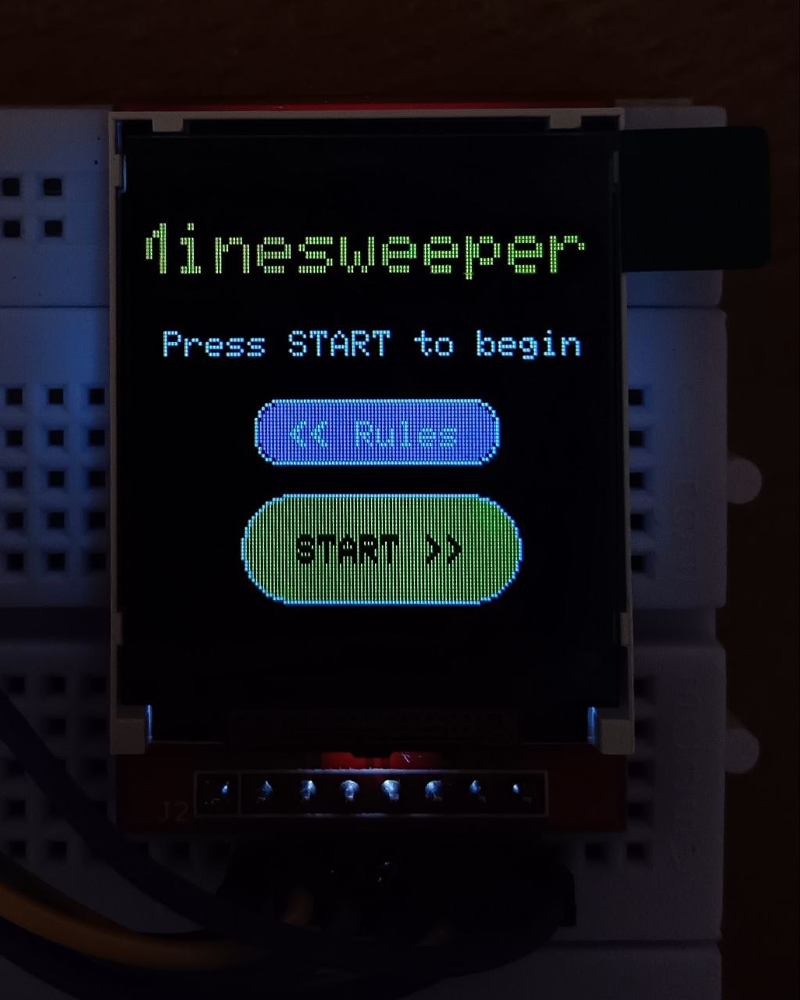
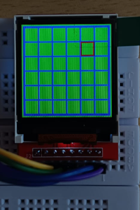
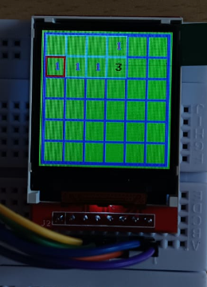
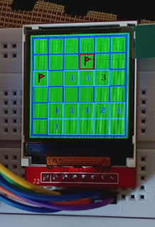
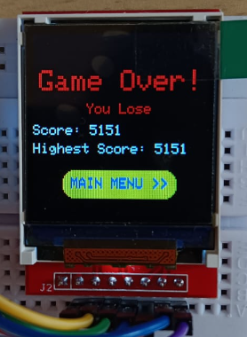
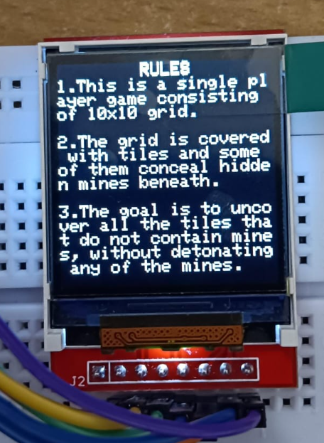
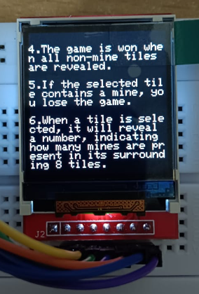
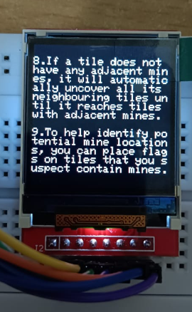
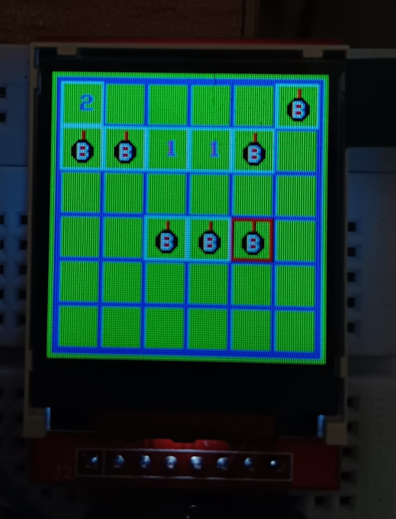

# GC_24_ARDUGEM_38
## Minesweeper Game
This project implements the classic Minesweeper game using an Arduino and a TFT display. The game allows players to uncover tiles on a grid while avoiding hidden mines.

### Hardware Requirements
- Arduino board
- TFT display (compatible with Adafruit_GFX and Adafruit_ST7735 libraries)
- Joystick module or buttons for input

### Software Requirements
- Arduino IDE
- Adafruit_GFX library
- Adafruit_ST7735 library

### Installation
1. Connect the hardware components according to the provided pin configurations in the code.
2. Install the required libraries in your Arduino IDE.
3. Upload the code to your Arduino board.

### Usage
1. Upon starting the game, the main menu will be displayed on the TFT screen. 
 
2. Press the "B" button in the joystick module to begin the game or Press the "D" button to go to the rules page. 
3. Use the joystick to move the cursor on the grid. Press “A” button to dig or uncover the hidden cell or press “C” button to flag the cell.
  

   
  

4. Avoid uncovering tiles containing mines. 
5. Use flags to mark potential mine locations. 
6. Win the game by uncovering all non-mine tiles, or lose by uncovering a mine. 
 

   
  

7. Your score will be displayed at the end of the game. 
8. Now again Press button “B” to go to Main Menu to play again. 

### Features
1. Main menu with options to start the game or view rules. 
 
2. Rules section explaining the game mechanics. 
 

   
  

3. Dynamic grid drawing on the TFT screen. 

4. Bomb and flag graphics for visual representation. 
 

   
  

5. Endgame screen displaying win/loss status and score and option to return to the main menu after finishing a game. 
 	 

   
  

### Credits
- This project is inspired by the classic Minesweeper game.
- Libraries used: Adafruit_GFX, Adafruit_ST7735.

### Notes
- You can customize the game parameters such as grid size and number of mines in the code according to your preferences by changing the cell size but keep in mind the computational power of Arduino UNO.

<video width="640" height="360" controls>
  <source src="Minesweeper.mp4" type="video/mp4">
  Your browser does not support the video tag.
</video>
